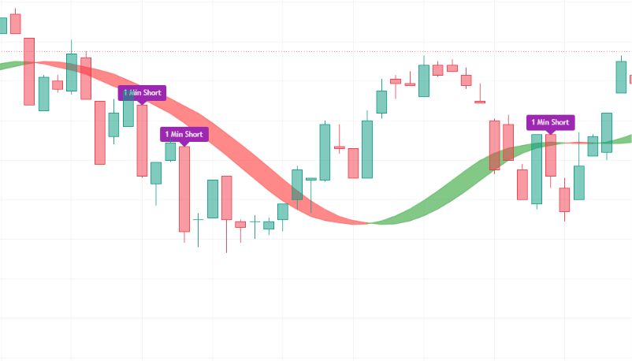

# Pine-Script-1-Minute-Based-Scalp-Indicator
High-precision 1-minute scalping indicator based on dual-candle polarity (1m & 3m), 5-EMA ribbon alignment with inflection hook detection, 1-minute MACD zero-line momentum, full Hull Suite stack containment, and strictly ordered multi-length RSI. Signals entry for Long and Short scalps on TradingView.
--
## Chart Preview

--
## Motivation & Problem
- **Severe Noise & False Reversals on the 1-Minute Chart**: Ultra-short timeframe scalping is notorious for fakeouts, where single-bar momentum spikes trigger entries directly into immediate trend exhaustion or counter-trend pullbacks.
- **The Core Goal**: To engineer a zero-compromise 1-minute execution system that filters out micro-noise by requiring complete confluence across multi-timeframe candle polarity, 5-stage EMA ribbon ordering with inflection hook validation, positive-zone MACD crossovers, and complete price/EMA stack clearance above or below the Hull Suite.
--
## Strategy Logic & Architecture
- This indicator avoids false signals and wrong interpretation of the trend by utilizing a **rule-based, multi-factor filtering system**:
### Core Components:
1. **Dual-Timeframe Candle Direction Alignment (1m & 3m)**:
  - Measures candle polarity across both 1-minute and 3-minute bars via 'request.security()'.
  - Requires both the 1m candle and the 3m candle to be simultaneously green ('GreenCandle') for longs, or simultaneously red ('RedCandle') for shorts.
2. **5-EMA Ribbon Alignment & Turning Hook Detection**:
  - Utilizes 5 EMAs on the 1-minute chart: lengths 3, 5, 7, 9, and macro baseline EMA 200.
  - **Hook Inflection**: Detects the precise moment fast EMA 3 pivots upward ('EMA1[0] > EMA1[1] and EMA1[1] < EMA1[2]') or downward ('EMA1[0] < EMA1[1] and EMA1[1] > EMA1[2]').
  - **Perfect Ribbon Hierarchy**: Mandates strict sequential ordering (EMA 3 > EMA 5 > EMA 7 > EMA 9 > EMA 200 for longs, inverted for shorts) with price trading on the correct side of EMA 200.
3. **Hull Suite Complete Stack Containment**:
  - Evaluates the Hull Suite band (HMA 55, 240m HTF) against both price and the entire moving average ribbon.
  - **AboveHull**: Requires close price and all four fast EMAs (3, 5, 7, 9) to be trading entirely above the Hull Suite baseline.
  - **BelowHull**: Requires close price and all four fast EMAs (3, 5, 7, 9) to be trading entirely below the Hull Suite baseline.
4. **MACD Momentum & Ordered Multi-Length RSI**:
  - **MACD**: Requires the 1-minute MACD line to cross above its signal line while residing strictly above zero for longs (or below signal and below zero for shorts).
  - **RSI**: Pulls 1-minute RSI across lengths 7, 9, and 12, requiring all three lines to be ordered sequentially above 55 ('RSI1 > RSI2 > RSI3') for longs or below 45 ('RSI1 < RSI2 < RSI3') for shorts.
5. **Execution Rules (1-Minute Timeframe)**:
  - **1 Min Long**: Triggers on the 1-minute chart when:
    1. 1m 5-EMA ribbon is in perfect bullish cascade with EMA 3 turning hook ('EMALong').
    2. 1m MACD line is above signal and above zero ('macdLong').
    3. Both 1m and 3m candles are green ('GreenCandle').
    4. Price and all four fast EMAs are stacked above Hull Suite ('AboveHull').
    5. 1m RSI (7, 9, 12) is sequentially aligned above 55 ('To3RSILong').
    - Renders a magenta "1 Min Long" label above the bar.
  - **1 Min Short**: Triggers on the 1-minute chart when:
    1. 1m 5-EMA ribbon is in perfect bearish cascade with EMA 3 turning hook ('EMAShort').
    2. 1m MACD line is below signal and below zero ('macdShort').
    3. Both 1m and 3m candles are red ('RedCandle').
    4. Price and all four fast EMAs are stacked below Hull Suite ('BelowHull').
    5. 1m RSI (7, 9, 12) is sequentially aligned below 45 ('To3RSIShort').
    - Renders a purple "1 Min Short" label above the bar.
--
## Configurable Parameters
Users can adjust the following parameters inside TradingView's settings panel:
- **EMA Lengths**: Default - 3, 5, 7, 9, 200. Individual toggle switches ('UseEMA1' to 'UseEMA5') and lookback lengths for the 1-minute ribbon stack.
- **MACD Settings**: Default - Fast Length 12, Slow Length 26, Signal Smoothing 9. Lookback timeframe set to 1m with 'UseMACD' toggle.
- **RSI Settings**: Default - 1m timeframe, lengths 7, 9, 12. Momentum threshold levels (55 / 45) with 'UseRSI' toggle.
- **Hull Suite**: Default - HMA length 55, 240m HTF. Customizable visual modes (HMA, EHMA, THMA), band transparency, and line thickness with 'UseHullSuite' toggle.
- **Ichimoku Settings**: Default - Conversion Line 9 with 'UseIchimoku' toggle.
--
## How to Install & Use in TradingView
1. Open any crypto chart (e.g., `BTC/USDT`) on **[TradingView](https://www.tradingview.com/)**.
2. Open the **`Pine Editor`** console at the bottom of the page.
3. Open `1-Min-Based.txt` (or your Pine Script file), copy the source code, and paste it into the editor.
4. Click **`Save`** and then click **`Add to Chart`**.
5. Set your chart timeframe strictly to **`1m`** and click the gear icon (`Settings`) on the indicator to adjust parameters as needed.
--
## Key Learnings & Engineering Reflections
1. **Turning Hook Inflection Logic ('EMA1[0] > EMA1[1] and EMA1[1] < EMA1[2]')**
  - I learned that detecting the local curvature pivot of the fastest EMA (EMA 3) captures the exact transition moment when micro-pullbacks end and trend expansion resumes, avoiding entering before the turn completes.
2. **Total Stack Clearance via Hull Suite**
  - I learned that requiring not just the close price, but all fast moving averages (EMAs 3, 5, 7, 9) to clear the Hull Suite band prevents taking trades inside messy consolidation clouds where moving averages are intertwined.
3. **Dual-Timeframe Candle Agreement (1m & 3m)**
  - I learned that requiring the 3-minute candle to match the 1-minute candle color ('GreenCandle' / 'RedCandle') provides an instant higher-timeframe directional filter with zero lag, eliminating counter-trend scalps.
